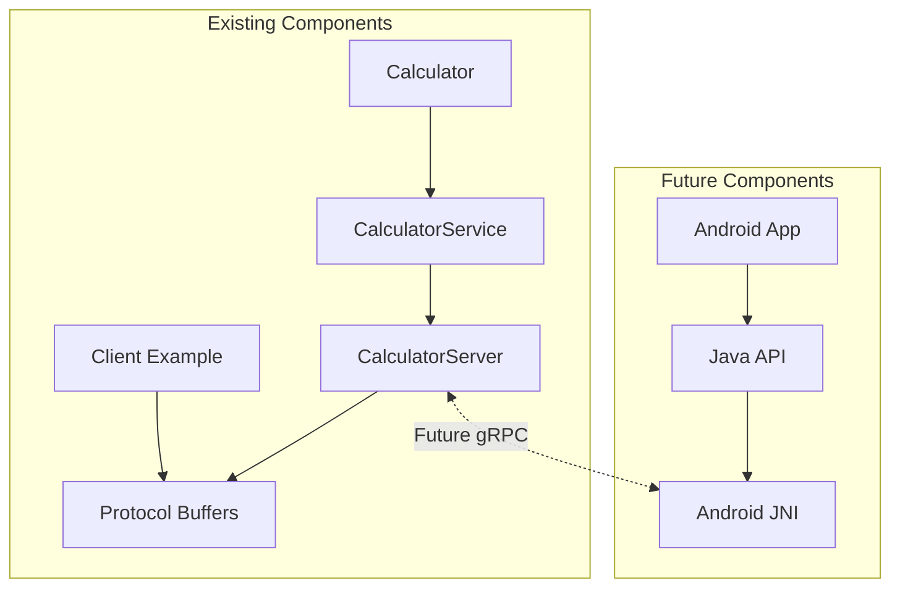

# Navigation-like Calculator Service - Staged Development Requirements

## Architecture Overview
```mermaid
graph TD
    subgraph Android App
        A[UI] --> B[Calculator Client]
        B --> C[Protobuf Serialization]
        C --> D[TCP Client]
    end

    subgraph Network
        D <-->|TCP/IP| E[TCP Server]
    end

    subgraph Calculator Service
        E --> F[Protobuf Deserialization]
        F --> G[Calculator Logic]
    end

    %% Data flow example
    H[Example Flow] -.->|1. Request: double a=5, b=3| C
    C -.->|2. Serialized bytes: 0x0A...| D
    D -.->|3. TCP packets| E
    E -.->|4. Received bytes: 0x0A...| F
    F -.->|5. Parsed: add(5,3)| G
```

### Message Flow
1. Android creates CalculationRequest
2. Protobuf serializes to bytes
3. TCP sends bytes over network
4. Service receives bytes
5. Protobuf deserializes to request
6. Calculator processes request
7. Response follows same path back

## Project Structure (Target)
```
modern-cpp-project/
├── src/                          # Core C++ code
│   ├── calculator.cpp            # Calculator implementation
│   ├── calculator_service.cpp    # Service implementation
│   ├── calculator_server.cpp     # Server implementation
│   ├── calculator_server_main.cpp # Server executable entry point
│   ├── protos/                   # Protocol buffer definitions
│   │   └── calculator.proto      # Service interface definition
│   └── include/                  # Public headers
│       └── calculator/
│           ├── calculator.hpp    # Calculator class definition
│           └── calculator_service.hpp # Service interface
│
├── examples/                     # Example clients
│   └── calculator_client.cpp     # Example C++ client
│
├── android/                      # Android integration (future)
│   ├── calculator-client/        # JNI wrapper library
│   └── app/                      # Demo Android app
│
├── tests/                        # Test suite
│   ├── calculator_test.cpp       # Calculator core tests
│   └── calculator_service_test.cpp # Service tests
│
├── build/                        # Build artifacts
├── CMakeLists.txt                # Main build configuration
└── conanfile.py                  # Dependency management
```

## Current Implementation Status

The project currently implements:

1. **Core Calculator Library**: 
   - Basic arithmetic operations (add, subtract, multiply, divide)
   - Edge case handling (division by zero)
   - Modern C++ with custom exceptions

2. **Protocol Buffer Interface**:
   - `calculator.proto` with operation types
   - Request/response message definitions
   - Error handling via response message

3. **Service Implementation**:
   - CalculatorService implementation
   - Request processing logic
   - Protocol buffer integration

4. **Server Architecture**:
   - Multi-threaded server implementation
   - Async calculation support
   - Client request handling

5. **Example Client**:
   - Command-line calculator client
   - Protocol buffer integration
   - Service connectivity

## CMake Structure
```cmake
# Root CMakeLists.txt (Actual)
cmake_minimum_required(VERSION 3.14)
project(CalculatorService VERSION 0.1.0)

# Dependencies managed with Conan
include(${CMAKE_BINARY_DIR}/conan_toolchain.cmake)
# ...

# Protocol buffer generation
find_package(Protobuf REQUIRED)
protobuf_generate_cpp(PROTO_SRCS PROTO_HDRS ${CMAKE_SOURCE_DIR}/src/protos/calculator.proto)

# Calculator library
add_library(calculator SHARED
    src/calculator.cpp
    src/calculator_service.cpp
    ${PROTO_SRCS}
)

# Server implementation
add_library(calculator_server_lib STATIC
    src/calculator_server.cpp
)

# Server executable
add_executable(calculator_server
    src/calculator_server_main.cpp
)

# Client example
add_executable(calculator_client
    examples/calculator_client.cpp
    ${PROTO_SRCS}
)

# Tests
add_executable(calculator_test
    tests/calculator_test.cpp
)

add_executable(calculator_service_test
    tests/calculator_service_test.cpp
    ${PROTO_SRCS}
)
```

## Future Development Roadmap

### Phase 1: Core Service Completion and Optimization
- [x] Basic calculator implementation
- [x] Protocol buffer interface
- [x] Minimal server implementation
- [x] Example C++ client
- [ ] Comprehensive error handling
- [ ] Performance optimization
- [ ] Service configuration options

### Phase 2: gRPC Integration
- [ ] Migrate from raw TCP to gRPC
- [ ] Update protocol definitions for streaming
- [ ] Implement bidirectional streaming for continuous calculations
- [ ] Add service discovery
- [ ] Authentication and security

### Phase 3: Advanced Service Features
- [ ] Calculation history and caching
- [ ] Persistent storage integration
- [ ] Subscription model for calculation updates
- [ ] Advanced math operations (trigonometry, etc.)
- [ ] Status monitoring and health checks

### Phase 4: Android Integration
- [ ] JNI wrapper implementation
- [ ] Native C++ library compilation for Android
- [ ] Java client API for Android
- [ ] Example Android application
- [ ] Performance optimization for mobile
- [ ] Battery usage optimization

### Phase 5: Production Features
- [ ] Logging and monitoring infrastructure
- [ ] CI/CD pipeline configuration
- [ ] Deployment automation
- [ ] Documentation generation
- [ ] Performance benchmarking suite

## Android Integration Plan

The Android integration will follow the same pattern as the navigation service:

1. **JNI Library Creation**
   - JNI wrapper around C++ calculator client
   - Native Android library (.so)
   - Java interface class

2. **Android Client API**
   - High-level Java API for calculator
   - Async operation support
   - Error handling
   - Resource management

3. **Example Android Application**
   - Simple calculator UI
   - Connection status indicator
   - Real-time calculation
   - Error display

## Testing Strategy

### Unit Testing
- Core calculator functionality
- Protocol buffer serialization/deserialization
- Calculator service request handling

### Integration Testing
- Service-to-client communication
- Error handling across boundaries
- Performance under load

### End-to-End Testing
- Full system operation
- Client-server communication
- Android app integration

## Build & Continuous Integration

### Build Requirements
- Conan for dependency management
- CMake for build configuration
- Protocol buffer compiler
- GTest for testing
- Android NDK for mobile builds

### CI Pipeline
- Build verification
- Unit test execution
- Integration test execution
- Code coverage analysis
- Static analysis
- Documentation generation

## Similarities to Navigation Service Architecture

This calculator service project follows a similar architecture to the navigation service:

1. **Core Library Approach**
   - Shared library for core functionality
   - Protocol buffer interface definition
   - Clean separation of concerns

2. **Server-Client Architecture**
   - Standalone server process
   - Client library for connectivity
   - Protocol buffer communication

3. **Android Integration Pattern**
   - JNI wrapper for C++ functionality
   - Java API for Android developers
   - Native code (.so) packaging

4. **Build System**
   - CMake-based build configuration
   - Conan for dependency management
   - Cross-platform compatibility

5. **Testing Strategy**
   - Multi-level testing approach
   - Unit tests for core functionality
   - Integration tests for components
   - End-to-end tests for full system

The existing calculator implementation provides a solid foundation that follows the same architecture principles as the navigation service, making it an excellent reference implementation and learning tool.

## Next Steps

1. Complete the core service implementation
2. Add comprehensive error handling
3. Implement additional server configuration options
4. Begin planning gRPC migration
5. Design Android JNI library architecture
6. Create initial Java API design

## Component Relationships



## Implementation Details

### Core Calculator

The calculator implements basic arithmetic operations with proper error handling:

```cpp
// Core calculator implementation
double Calculator::add(double a, double b) {
    return a + b;
}

double Calculator::subtract(double a, double b) {
    return a - b;
}

double Calculator::multiply(double a, double b) {
    return a * b;
}

double Calculator::divide(double a, double b) {
    if (b == 0.0) {
        throw DivisionByZeroError();
    }
    return a / b;
}
```

### Protocol Buffer Interface

The protocol buffer definition establishes the service interface:

```protobuf
syntax = "proto3";

package calculator;

message CalculationRequest {
  double a = 1;
  double b = 2;
  enum Operation {
    ADD = 0;
    SUBTRACT = 1;
    MULTIPLY = 2;
    DIVIDE = 3;
  }
  Operation operation = 3;
}

message CalculationResponse {
  double result = 1;
  string error = 2;  // Empty if no error
}
```

### Service Implementation

The service layer connects the protocol buffer interface to the calculator core:

```cpp
CalculationResponse CalculatorService::Calculate(const CalculationRequest& request) {
    CalculationResponse response;
    
    try {
        switch (request.operation()) {
            case CalculationRequest::ADD:
                response.set_result(calculator_.add(request.a(), request.b()));
                break;
            case CalculationRequest::SUBTRACT:
                response.set_result(calculator_.subtract(request.a(), request.b()));
                break;
            case CalculationRequest::MULTIPLY:
                response.set_result(calculator_.multiply(request.a(), request.b()));
                break;
            case CalculationRequest::DIVIDE:
                response.set_result(calculator_.divide(request.a(), request.b()));
                break;
            default:
                response.set_error("Unknown operation");
                break;
        }
    } catch (const DivisionByZeroError& e) {
        response.set_error(e.what());
    } catch (const std::exception& e) {
        response.set_error(std::string("Calculation error: ") + e.what());
    }
    
    return response;
}
```

## Android JNI Implementation Plan

### 1. JNI Wrapper Structure
```
calculator-android/
├── calculator-lib/              # Native library module
│   ├── src/
│   │   ├── main/
│   │   │   ├── cpp/
│   │   │   │   ├── calculator_jni.cpp     # JNI implementations
│   │   │   │   ├── calculator_jni.h       # JNI headers
│   │   │   │   └── calculator_client.hpp  # C++ client wrapper
│   │   │   │
│   │   │   └── java/
│   │   │       └── com/example/calculator/
│   │   │           ├── Calculator.java     # Java API
│   │   │           ├── CalculationResult.java  # Result wrapper
│   │   │           └── CalculatorException.java # Custom exceptions
│   │   │
│   │   └── AndroidManifest.xml
│   │
│   ├── CMakeLists.txt          # Native build configuration
│   └── build.gradle            # Android library configuration
```

### 2. JNI Interface Design
```java
// Calculator.java
public class Calculator {
    static {
        System.loadLibrary("calculator_jni");
    }

    // Native methods
    private native void nativeInit(String serverAddress, int port);
    private native void nativeDestroy();
    private native double nativeCalculate(double a, double b, int operation);
    
    // Java API
    public void connect(String serverAddress, int port) {
        nativeInit(serverAddress, port);
    }
    
    public void disconnect() {
        nativeDestroy();
    }
    
    public double calculate(double a, double b, Operation op) 
        throws CalculatorException {
        return nativeCalculate(a, b, op.ordinal());
    }
}
```

### 3. C++ Implementation
```cpp
// calculator_jni.cpp
extern "C" {

JNIEXPORT void JNICALL
Java_com_example_calculator_Calculator_nativeInit(
    JNIEnv* env, jobject thiz, jstring server_address, jint port) {
    // Initialize calculator client
    // Connect to server
}

JNIEXPORT jdouble JNICALL
Java_com_example_calculator_Calculator_nativeCalculate(
    JNIEnv* env, jobject thiz, jdouble a, jdouble b, jint operation) {
    // Convert and forward to C++ client
    // Handle errors and exceptions
}

} // extern "C"
```

### 4. Error Handling
- Convert C++ exceptions to Java exceptions
- Proper resource cleanup
- Connection state management
- Memory management between Java/C++

### 5. Resource Management
- RAII in C++ layer
- Proper JNI reference management
- Automatic cleanup in Java finalizers
- Connection lifecycle management

### 6. Build Integration
```cmake
# CMakeLists.txt for Android
add_library(calculator_jni SHARED
    calculator_jni.cpp
)

target_link_libraries(calculator_jni
    calculator_client    # Our client library
    ${log-lib}          # Android logging
)
```

### 7. Testing Strategy
1. **Unit Tests**
   - Java API tests
   - JNI method tests
   - Error handling tests

2. **Integration Tests**
   - Connection tests
   - Calculation flow tests
   - Resource cleanup tests

3. **Memory Tests**
   - Leak checks
   - Reference counting
   - Stress tests

## Development Standards

### C++ Standards
- C++17 minimum
- Strong type safety
- RAII principles
- Exception handling for errors
- CMake for build system
- Conan for dependencies
- GTest for testing

### Android Standards
- Java/Kotlin for Android API layer
- JNI for native code integration
- Proper resource management
- Lifecycle-aware components
- Android best practices
- Unit testing of all components

### Documentation Requirements
- API documentation
- Architecture documentation
- Build instructions
- Test documentation
- Example usage

## Sample Usage Pattern

```kotlin
// Android client example using Java API
val calculatorClient = CalculatorClient.Builder()
    .setServerAddress("10.0.2.2")
    .setServerPort(50051)
    .setConnectionTimeout(5000)
    .build()

calculatorClient.connect { connected ->
    if (connected) {
        // Perform calculation
        calculatorClient.calculate(5.0, 3.0, Operation.ADD) { result, error ->
            if (error == null) {
                // Update UI with result
                runOnUiThread {
                    resultTextView.text = "Result: $result"
                }
            } else {
                // Handle error
                runOnUiThread {
                    resultTextView.text = "Error: $error"
                }
            }
        }
    } else {
        // Handle connection failure
        runOnUiThread {
            statusTextView.text = "Connection failed"
        }
    }
}
```

## Contribution Guidelines

1. Code must follow existing style and conventions
2. All new code must have unit tests
3. Documentation must be updated with changes
4. CI pipeline must pass
5. Code review required before merge

## Conclusion

This calculator service project serves as both a functional reference implementation and a learning tool for understanding the architecture patterns used in the navigation service. By implementing a similar architecture with protocol buffers, service layer, and planned Android integration, it provides a foundation for understanding the larger, more complex navigation service codebase.

The project demonstrates:
- Modern C++ practices
- Protocol buffer integration
- Service-oriented architecture
- Clean API design
- Testing strategies
- Cross-platform development

The roadmap outlines a clear path to evolve this from a simple calculator to a more sophisticated service with Android integration, following the same architectural principles as the navigation service.